Information graphics should allow all viewers to easily understand raw data. These graphics can also provide interesting and alternative perspectives on a dataset.

> It doesn’t matter how good a chart looks if it doesn’t communicate anything!  
&mdash; [Mike Bostock &mdash; Let’s Make a Bar Chart, III](http://bost.ocks.org/mike/bar/3/#communicating)

Unfortunately, in many cases aesthetics take precedence over clarity, with poor use of colour and little or no labelling. Such graphics are difficult for viewers to decipher, especially viewers with some form of visual impairment.

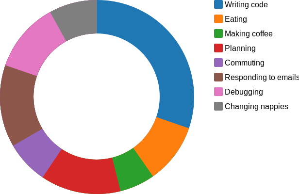

We've all seen this type of chart, from web analytics systems to time trackers and fitness apps. Although this chart might look nice it's really poor at its job, which is to make it easy to understand the raw data.

The above chart works for most people, however approximately 8% of the male population and 0.4% of the female population has some form of colour vision deficiency[^1]. Overall 285 million (~4%) people worldwide suffer some form of visual impairment[^2].

In this article we'll look at the difficulties faced by viewers with impaired colour vision and then define some patterns to minimise these difficulties.

For brevity we'll refer to *Colour Vision Deficiency* as CVD.

### Full Spectrum Confusion

Our contrived example of a chart that seems easy to understand. We've added a helpful legend and the use of bright colours should make it easy to link the segments to their key in the legend.

Unfortunately, a viewer with CVD will likely find it difficult to distinguish several colours in this chart. The graphics below use modified colour values to simulate various forms of CVD[^1].

    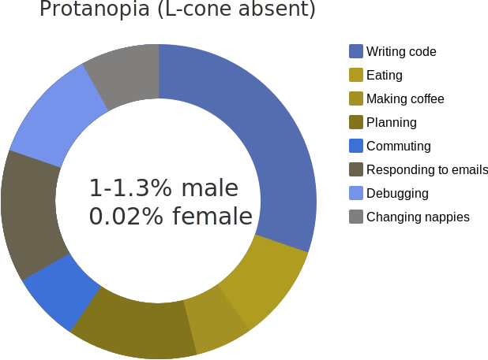
    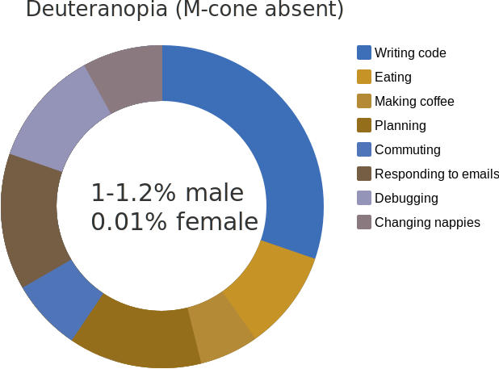
    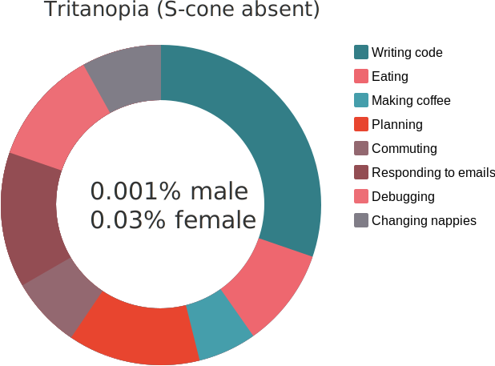
    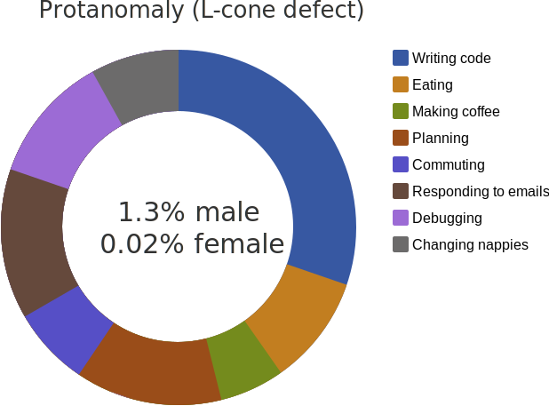
    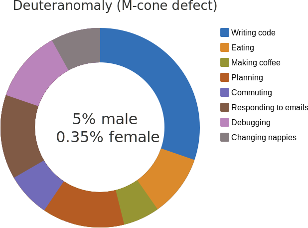
    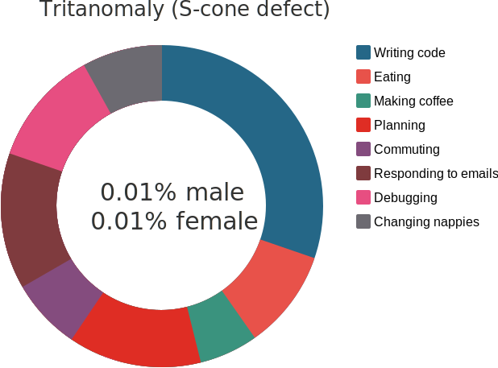

The difference in colour is quite stark. Although it's still possible to differentiate colours at their boundaries it's difficult to link the segments to their keys in the legend.

For example, viewers with deuteranomaly will likely struggle to distinguish data points 'Writing code' and 'Commuting'.

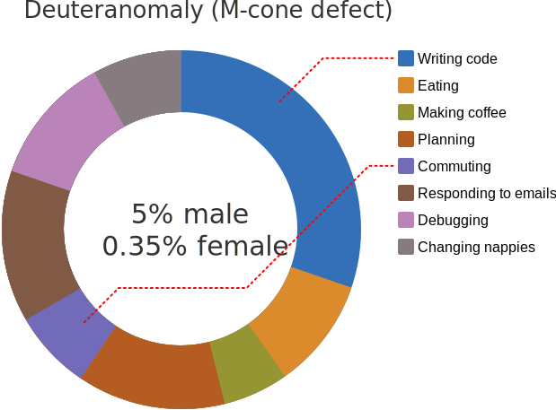

Some viewers may even find it impossible to distinguish these colours. For viewers with tritanopia the data points for 'Eating' and 'Debugging' are almost completely identical.

Linking these segments to the keys requires extra mental effort and in some cases &mdash; from personal experience &mdash; the help of a colour picker tool.

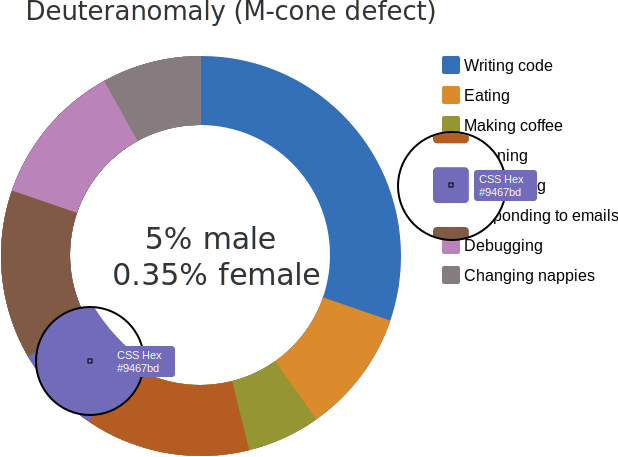

Factors such as screen quality, brightness, contrast and even lighting within a room can affect the ability of a viewer to distinguish individual colours.

You may have noticed the order of the legend keys matches the order of the segments, however a viewer &mdash; especially with those with CVD &mdash; cannot be certain of this. For example in a line chart the legend order is not likely to match the order of the data lines at any given point on an axis.

### Better Colour Choices

So how can we choose more helpful colour combinations? Well it seems obvious, choose contrasting colours.

As you might have guessed it's not actually so simple. Even primary-secondary colour combinations have the potential to confuse, depending on the type of CVD a viewer has. Both the blue/magenta and green/yellow colour pairs could be confusing.

<svg id="secondary" class="chart"></svg>

To avoid confusion you could switch magenta for a more contrasting tertiary colour like orange and the green for a grey. 

Below are the same colour wheels but modified to simulate what a viewer with Deuteranopia (~5% of viewers) would see.

Although not completely foolproof this combination of colours is less likely to cause confusion.

Using colour alone to encode information is not a reliable way to cater for all forms of CVD. Depending on the type, viewers with dichromacy (~2% of males) will struggle with some of the combinations in the *improved* wheel above.

That said, choosing contrasting colours is a good start in helping those with CVD understand your data. Viewers with anomolous trichromacy (~6% of males and ~0.01% of females) will be less likely to struggle with contrasting colour choices.

### Patterns to the Rescue

Rather than relying solely on colour to display information patterns provide a better way for viewers to differentiate information.

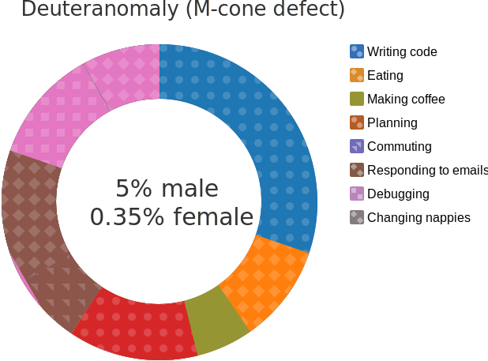

Now a viewer with CVD can map the segments to the keys.

A great example of patterns being used to aid visually impaired viewers is the [London Underground Map (PDF)](https://tfl.gov.uk/cdn/static/cms/documents/large-print-tube-map.pdf).

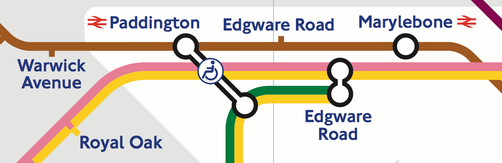

The same map can also be viewed in [black &amp; white (PDF)](https://tfl.gov.uk/cdn/static/cms/documents/bw-large-print-map.pdf).

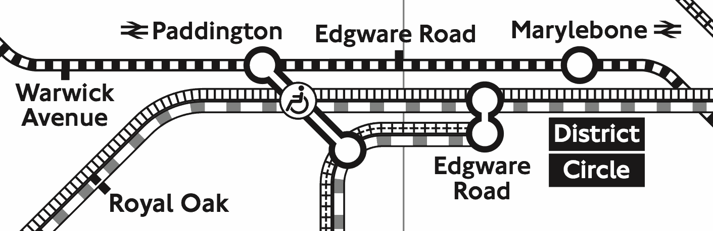

As well as helping viewers with CVD the high contrast of the black and white map helps viewers with other visual impairments.

Rather than having two versions the map could use colour and patterns to provide a more accessible version of the standard map.

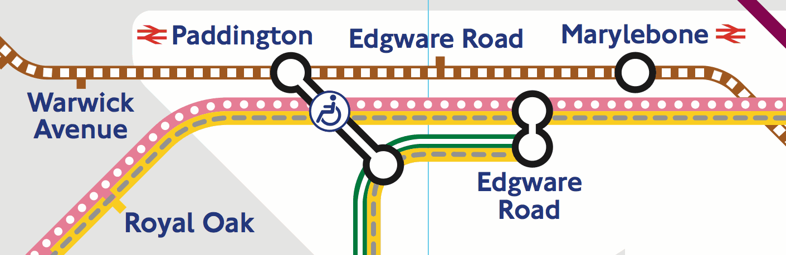

### "But it looks ugly!"

The designer in you is likely not impressed. However, the desire for aesthetics is one of the main drivers for inaccessible information design.

The *primary* goal of information design should be to make information digestible to as many viewers as possible, aesthetics should always come second. However, it really should be possible to create information design that is both beautiful and usable.

If it's not desirable to incorporate patterns into a graphic then instead you can offer the option to view a more accessible version. For example: [Trello](https://trello.com) offers a *color blind friendly mode* when viewing labels.

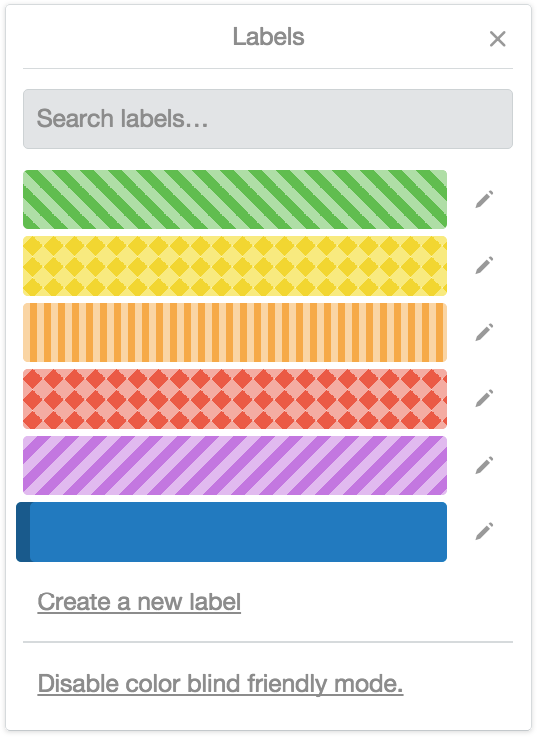

Note that the setting isn't hidden away but is placed where the viewer needs it most.

### Label Your Data

Considering the issues with colour perception and the aesthetic drawbacks of using patterns, an alternative is to label your graphics. If the segments are labelled then the legend can be completely removed.

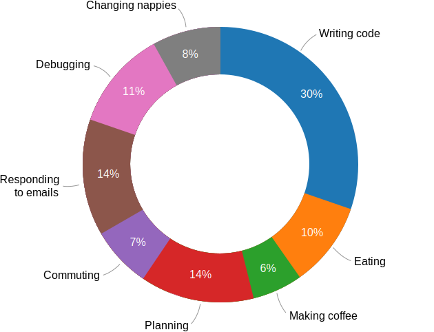

The viewer no longer has to waste mental effort linking the legend keys to the data in the graph. The added bonus is that we don't need crazy patterns.

Ideally the labels should be visible by default as in the example above. Alternatively the labels can be shown when the viewer interacts with the graphic. [Chart.js](http://www.chartjs.org/), [Chartist.js](https://gionkunz.github.io/chartist-js/) and [Google Charts](https://developers.google.com/chart/) (and many others) use interactive labels. When the viewer interacts with a segment/data point a label tooltip is shown.

    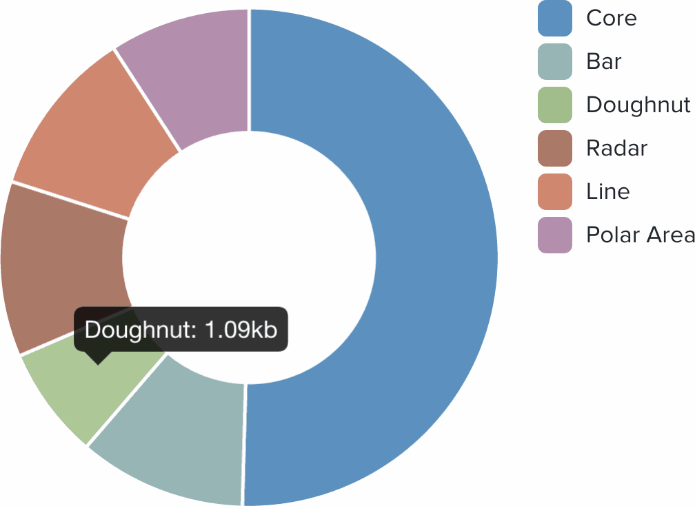
    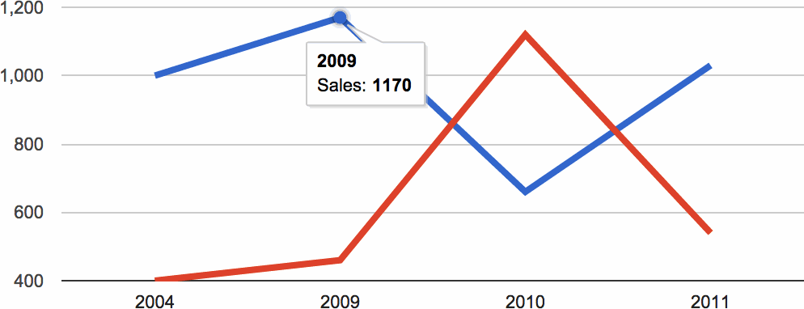

### Conclusion

Accessibility is of primary importance when creating data graphics. Aesthetics should always come second but in many cases can complement the accessibility of a design.

The best way to make your graphics accessible is to provide labels, ideally without the need for viewer interaction. Don't use colour as the only way for your viewers to understand your graphic. If it isn't possible for your graphic to provide labels then use sensible colour combinations and interactive labels (tooltips).

Below are some useful resources and tools that will help you to create better graphics.

### Useful Resources

- [Sim Daltonism &mdash; simulate different forms of CVD](https://michelf.ca/projects/sim-daltonism/)
- [Contrast Ratio &mdash; colour contrast checker](http://leaverou.github.io/contrast-ratio/)
- [Tips for Designing Scientific Figures for Color Blind Readers](http://www.somersault1824.com/tips-for-designing-scientific-figures-for-color-blind-readers/)
- [Choosing Safe Colours](http://safecolours.rigdenage.com/colourchoice.html)

---

### References

[^1]: http://www.colour-blindness.com/general/prevalence/
[^2]: http://www.who.int/mediacentre/factsheets/fs282/en/

