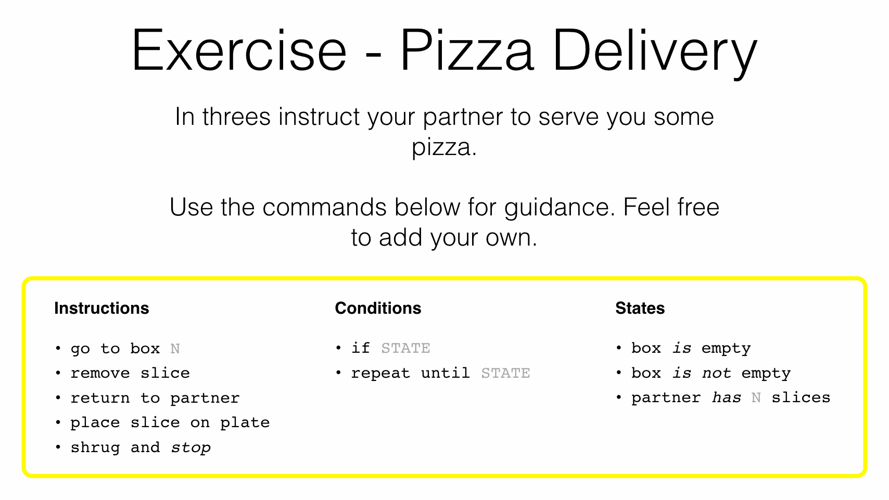
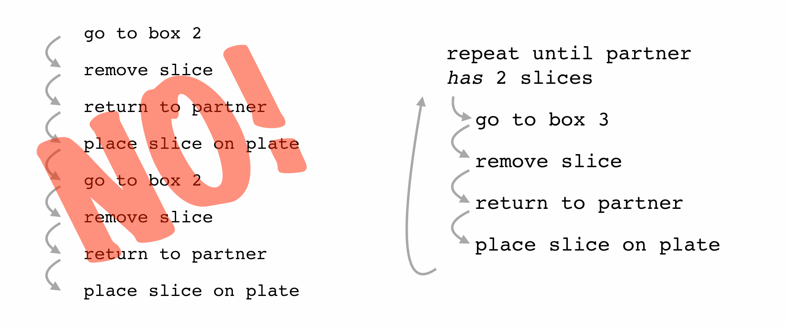
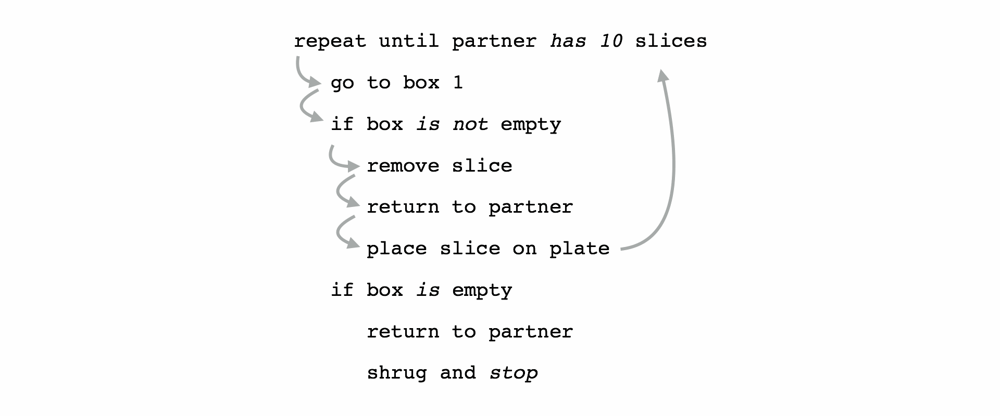
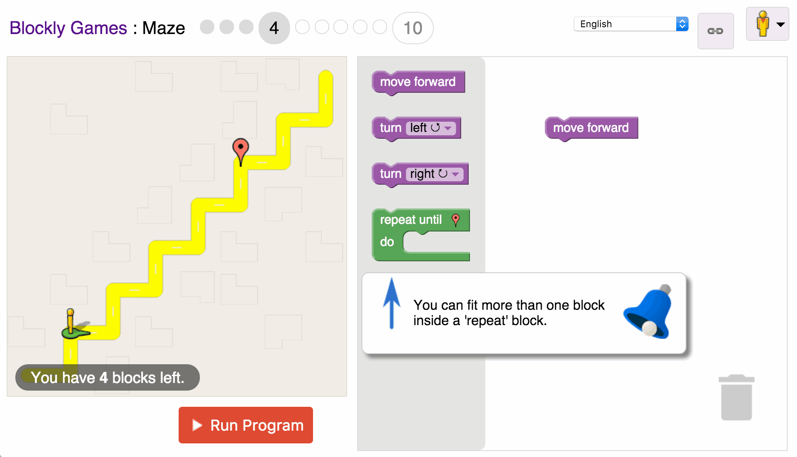

*Image credit: [Nirzar Pangarkar](https://unsplash.com/photos/KK1hlAI2lgE).*

A little while ago I ran some sessions at [Adjust Your Set](http://adjustyourset.com/) to teach people about programming. AYS management had expressed an interest in programming sessions. The sessions would teach non-technical employees about coding. Improving understanding of how the tech team execute creative ideas, designs and bug fixes.

Boy it's tough to teach programming! It's fiendishly difficult to explain what a developer might think of as simple. Take this trusty `for` loop example.

```javascript
for (var i=0; i<=items.length; i++) {
    // do something
}
```

Just imagine you know nothing about programming, this small snippet makes no sense.

I've found in the past that it's easy to explain what this block of code does. Explaining why it's written that way is almost impossible with words (and code) alone. There's a lot going on in that little `for` loop, we have

- a reserved word,
- statement separation,
- variable declaration and assignment,
- two variable types (integer and array),
- some comparison logic,
- an array property,
- an increment operator,
- two different types of bracket,
- and finally a comment,
- oh and no forgetting some whitespace.

That's a lot to cover in a 45 minute sessions with absolute beginners.

### The Humble Algorithm

First point of order, **put your beautiful code away, you won't be needing it yet**. Whether it's Python, Ruby, JavaScript, C, Pascal, Fortran or even [LOLCODE](http://lolcode.org/), don't inflict it on your audience. They *won't* understand your code examples. They *will* sit there and nod slowly as you explain why variable declaration requires the `var` keyword, or that a variable can have a type. This I have learnt from the uncomfortable experience of looking around a sea of blank faces.

Instead of actual code the best place to start is the (not so humble) algorithm.

> An algorithm is a set of steps that can be followed, by a computer or human

Give your audience this simple definition. People understand instructions, they deal with them every day. Ask for examples of real world algorithms.

You need your audience to grasp that these lists of instruction have a logical order. You shouldn't drink the boiling water from the kettle and then swallow a teabag, this will result in a fatal error.

This is you first 'in' to help beginners understand programming. Go through their example algorithms on a white board, let them guide the logical order and detail. It's worth remarking at this point that programmers often use pseudocode to plan real code.

### Programming Humans

Now that you've covered what an algorithm is you can get stuck in to programming. Get everyone into groups of three (this allows for pair programming).

[Adjust Your Set](http://adjustyourset.com) kindly provided pizza during internal talks and training sessions. Pizza is the perfect teaching tool. Each group should nominate one person to be the pizza fetching robot. The other two members should write an algorithm to instruct their 'robot' *how* to get pizza.

I've found that it's helpful to introduce some basic statements as a guide to programming your pizza robot. This list gives people a little guidance and hopefully stops people just writing `fetch pizza`.


*Pizza Delivery Instructions*

The more people in the room the better this task gets. Provide some helpful hints as your groups work, especially as bugs arise. Popular pizza will run out, people will bump into each other and if you're lucky no-one will drop any on the floor.

### Debugging Humans

As the logistical problems of programming humans to fetch pizza arise this is your chance to introduce the concept of debugging. Stop everyone where they are and ask what problems they had.

Did anyone just write `fetch pizza`? Did everyone get the type they wanted? Did a box run out? What did they do about it? Then Introduce the steps below.

1. Write some code
2. Run the code
3. Check if there were problems
4. Locate the instruction (line) that caused the problem
5. Change the instruction, remove it or add more instructions
6. Go to step 2

Some of your group will already started debugging without realising, others may be struggling. With the list above they should now be able to refine their algorithms to perfection (given enough time).

> If debugging is the process of removing bugs, then programming must be the process of putting them in
>
> &mdash; Edsger W. Dijkstra

This quote always goes down well. I put in on the screen while helping to debug people's algorithms.

### Code Review

Now that all the pizza is gone (or on the floor) we can review some of the issues and solutions. Get a volunteer group to write their algorithm on the whiteboard and explain the bugs they found. Start with their first attempt and then explain the progression to their final solution.

This is a good point to invite feedback from the room. Did anyone have a better solution? Make them write it on the board.

Now that you have working algorithms you can re-iterate the steps that make good pizza fetching algorithm. This is a great leveller as although some people may have a good solution others may have struggled.


*Algorithm to fetch a pizza slice*

I start with the above algorithm and ask if anyone just repeated it. Did they improve on it? Explain why repeating the code is bad.


*Getting more than one slice*

Next I ask if anyone encountered an empty box. How do we deal with an empty box?


*Dealing with an empty box*

It's important to use these slides to help people understand why we use loops, ifs and other logic. The pizza exercise is fun, understanding things is easier when it's fun. When you finally crack out those sorting algorithms in Python they might stand a chance.

### The Element of Competition

Now your pupils are armed with this new knowledge you can set them loose testing their skills against each other. I've found an element of competition helps people concentrate their efforts.

Google's [Blockly Maze Game](https://blockly-games.appspot.com/maze?lang=en) is perfect for would-be programmers to test their newfound skills.


*Google's Blockly Maze game*

The game uses a [Scratch](https://scratch.mit.edu/) style interface with drag and drop blocks of logic. Players must create an algorithm that will move the little person to the Google Map marker.

It's a good idea to give a quick introduction to the game's interface. Explain the drag and drop elements. Make sure to point out the 'Run Program' button as some people will miss it.

Staying in groups get everyone to bring up the game and work through the levels. It's a good idea to keep moving around the room checking that no-one is stuck and providing some hints. I've found that by letting everyone know which group is ahead the others will work harder to try and catch up. As the levels get harder those racing ahead may also get stuck.

It's unlikely anyone will complete all 10 levels before the end of the session. If you want to incentivise people, offer a prize to the first group/person to complete the game. On one occasion, at the end of the 45 minute session, a small group of participants decamped to the sofas outside. After 40 minutes and some heated debate the game was complete.

### The Next Steps

Should any of your participants want to continue their learning it's a good idea to have some resources available. Below are a few I like to recommend.

- [Khan Academy &ndash; Hour of Code](https://www.khanacademy.org/hourofcode)
- [Scratch](https://scratch.mit.edu/)
- [Code Academy](https://www.codecademy.com/)
- [Team Treehouse](https://teamtreehouse.com/) (paid)

Let them know they can come to you for help when learning to code. I find it's best to tell them to email you with questions. That way they won't come to your desk.

### Wrapping Up

Hopefully this article has inspired you &mdash; should you know how to program &mdash; to pass on your wisdom to others. Teaching is a great way to improve your knowledge and confidence as a developer. Just keep the following in mind.

- Keep it short, 45 mins max
- Keep it simple, write in pseudocode
- Make it interactive, get them to show their work, invite feedback
- Make it fun, play games, offer prizes
- Move around, help those who struggle
- Be positive and encouraging

That last point is an important one. Developers often become irritated when people fail to grasp simple subjects. *Don't get annoyed*, offer advice and push people in the right direction. You'll learn more helping those in need and they'll leave feeling they achieved something.

Now that you've taught your audience about algorithms, you can move into some more complicated areas. Good luck! Explaining variables and constants, its surprisingly hard.